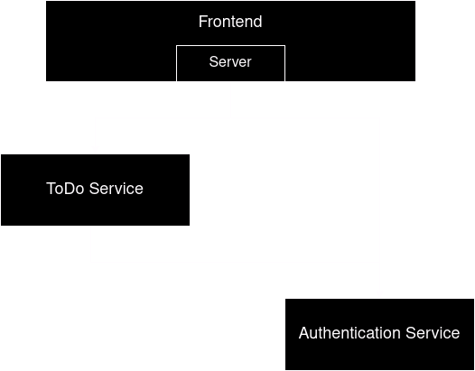

# split monolith and deploy to cloud using CI/CD

We are going to split an existing monolithic application into microservices and deploy it to the cloud.  
The application is called flou and serves as a focus dashboard in the web. It consists of a SvelteKit frontend, a Spring Boot backend and a PostgreSQL database.

We are planning to containerize the frontend and microservices of this application using Docker, orchestrate them using Kubernetes and deploy on GCP. The Kubernetes cluster will be monitored by Dynatrace.
Furthermore, we are going to implement this with CI/CD using GitHub Actions to allow for fast and stable deployment.

## team

Fabian Schoenberger, k12308997  
Alex Siala, k12309011  
Philipp Olivotto, k12223453

## architecture

## CI/CD flow

## tasks

* continuous documentation (everyone)
* split backend into microservices (Fabian Schoenberger)
* containerization using Docker (Fabian Schoenberger)
* automatic builds using GitHub actions (Alex Siala)
* orchestration using Kubernetes (Philipp Olivotto)
* deployment to GCP using GitHub actions (everyone)
* integrate Dynatrace for Kubernetes monitoring (Philipp Olivotto)
* presentation (everyone)

## demo flow
* Deployment of a new version of the backend service / frontend service
    * Github Actions: What is triggered? What is done in the background (tests)?
    * Kubernetes: Check currently running nodes, pods and containers. What is done in the background?
* Github Actions - check used files
    * Triggers (Workflow)
    * File for building image
    * Test files
* Kubernetes - check used files
    * Deployment YAML
