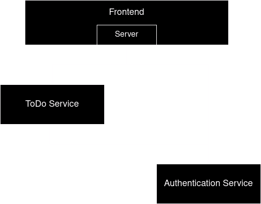

# 1. Architecture

The previous architecture used a simple monolithic approach with a server-side rendered frontend and a large backend, which is responsible for every feature.  

.png)

This means adding new features or updating existing ones would require significant downtime;
Also, as the backend grows in features, complexity makes finding issues and improving on said features more complicated.

Splitting the backend into multiple microservices can help mitigate these problems.

Our approach to splitting the backend was to factor out different features and determine their dependencies.
This approach led us to the following architecture.



The previous monolithic backend was split into two microservices since these are the only features that require a backend.
Obviously, as the number of features grow, so would the count of microservices.  

The ToDo microservice needs to match ToDos to a user, meaning it depends on the authentication service.  
This is solved using the following approach.


The frontend only needed minor adjustments due to the modular nature of our API handling.

# 2. Google Cloud Platform
To deploy the application on Google Cloud Platform (GCP), we need a GCP Project with a GKE (Kubernetes) cluster and two PostgreSQL databases. 
Follow these steps to prepare the environment:

1. Create a New Project\
Start by creating a new project in GCP named `flou`. Note down the generated `GCP_PROJECT_ID`, as it will be required in later steps.

2. Set Up a Service Account and get the SA_KEY\
Navigate to `IAM & Admin > Service Accounts` in the GCP Console. Create a service account with permissions to access and manage the GKE cluster (Kubernetes Engine Service Agent role).
Once the service account is created, generate a JSON key for it. Securely store this key file, as it will be used later as the `GCP_SA_KEY`.

Now the preparations are done and we can setup the rest.

## Databases
TODO: we have to create two databases...

## GKE Cluster
We create a GKE Cluster in GCP using the webpage. When creating the cluster we use the 'Standard mode'. We change it's 
name to `flou-cluster-1` and keep all the other settings at default.
This will create a Kubernetes cluster with 3 nodes, which is then used to host all of our services (frontend-service, todo-service, authentication-service).

Now we manually add some secrets to the cluster, which can be used by the pods as environment variables.
For that we first connect to the cluster in the `Google Cloud Shell`: (The command can be accessed from the Webpage)
```shell
gcloud container clusters get-credentials flou-cluster-1 --zone your-cluster-zone --project your-project-id
```
Now kubectl is configured for our cluster and we can add needed secrets.
```shell
kubectl create secret generic weather-api-key --from-literal=WEATHER_API_KEY=your-weather-api-key
kubectl create secret generic temp-ics --from-literal=TEMP_ICS=your-temp-ics
TODO: what else is needed? ...database credentials...
```

# 3. Docker builds

## backends

To prepare the build of either backend, execute the following in the respective directory:

```shell
./gradlew dependencies
./gradlew bootJar
```

This downloads dependencies and builds the application.

To build the image execute the following:

```shell
docker build -t <name> .
```

## frontend

To prepare the build of the frontend execute the following in its directory:

```shell
npm clean-install
npm run build
```

This downloads dependencies according to `package-lock.json` and builds the application.

To build the image execute the following:

```shell
docker build -t <name> .
```

# 4. Github Actions

The project uses two separate workflows, build.yml and deploy.yml, to ensure a clean and structured CI/CD pipeline.

## Workflow Overview

- **build.yml**: Responsible for building and pushing Docker images for the project's components.
- **deploy.yml**: Handles deployment of the application to a Kubernetes cluster on Google Cloud Platform (GCP).

## Prerequisites

Ensure the following secrets are configured in your GitHub repository:
- `DOCKER_USERNAME`
- `DOCKER_PASSWORD`
- `GCP_PROJECT_ID`
- `GCP_SA_KEY`

- Ensure all Kubernetes manifests (`k8s/*.yaml`) are correctly configured with the appropriate Docker image paths.
- Tags (`v*`) should follow a semantic versioning convention to maintain clarity.
- Both workflows work together, but `deploy.yml` is dependent on the success of `build.yml`.


## build.yml

The `build.yml` workflow build an pushes Docker images.
Each image is tagged with the Git tag that triggered the workflow (`github.ref_name`).
Ensures consistency between code versions and image versions.

1. **Triggered By**: 
   - A `push` to any version tag (`v*`).
   
2. **Actions**:
   - Checks out the code.
   - Sets up Docker Buildx.
   - Logs in to Docker Hub using saved secrets.
   - Builds and pushes Docker images for:
     - **Authentication Service**
     - **Frontend**
     - **ToDo Service**

3. **Required Secrets**:
   - `DOCKER_USERNAME`: Your Docker Hub username.
   - `DOCKER_PASSWORD`: Your Docker Hub password or access token.

## deploy.yml

The `deploy.yml` workflow ensures the application is deployed to a Kubernetes cluster.
Utilizes Kubernetes manifests (`k8s/*.yaml`) to deploy the application.
Ensures the latest Docker images (built in `build.yml`) are used.

1. **Triggered By**: 
   - Depends on the successful completion of the `build.yml` workflow.

2. **Actions**:
   - Checks out the code.
   - Sets up the Google Cloud SDK.
   - Authenticates with GCP using a Service Account.
   - Deploys the application using Kubernetes manifests:
     - **Authentication Deployment**
     - **Frontend Deployment**
     - **ToDo Deployment**

3. **Required Secrets**:
   - `GCP_PROJECT_ID`: The Google Cloud project ID.
   - `GCP_SA_KEY`: A JSON key for a Google Cloud Service Account with permissions for Kubernetes Engine.


